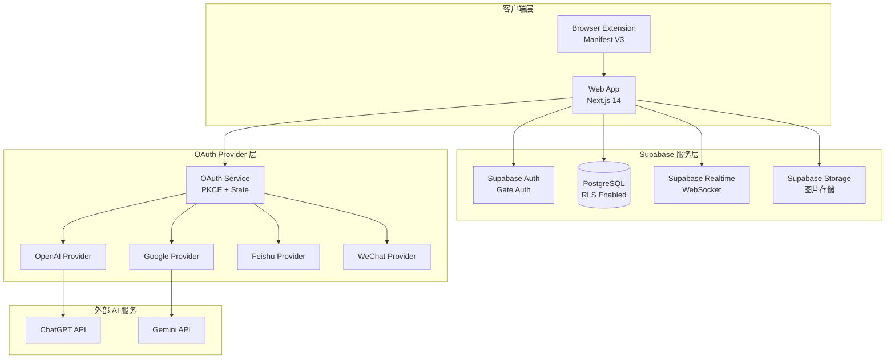
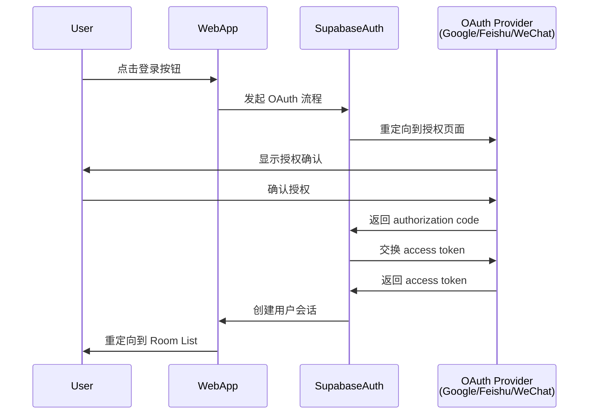
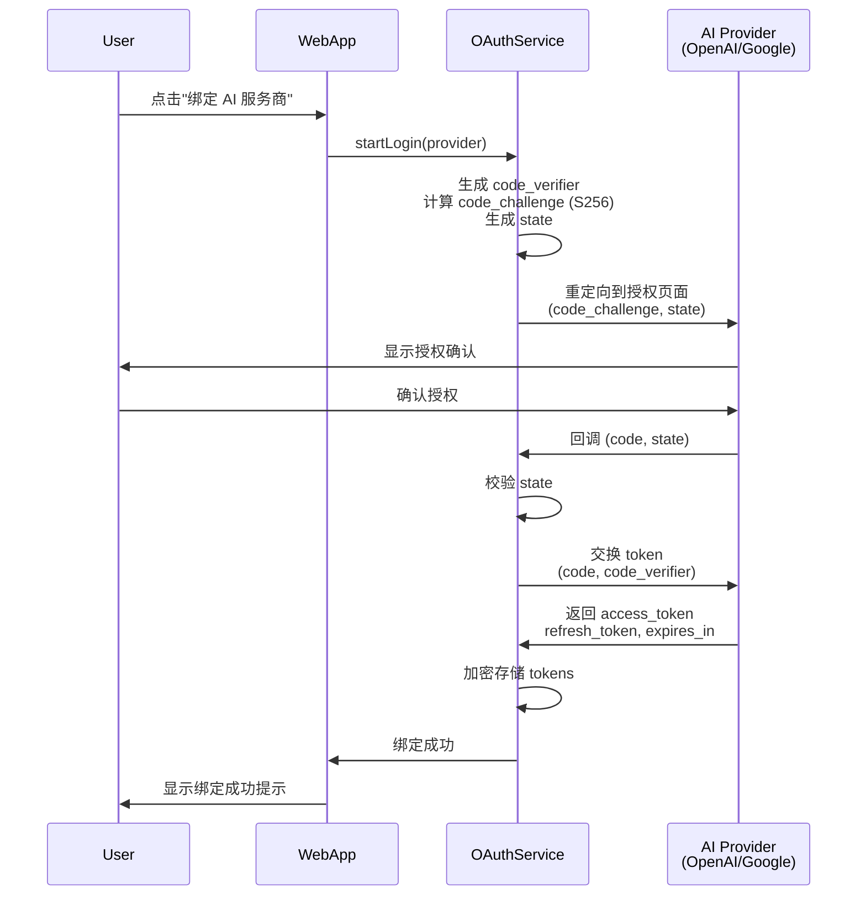
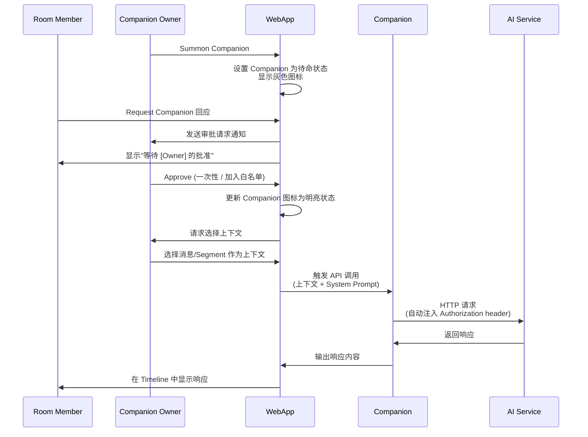
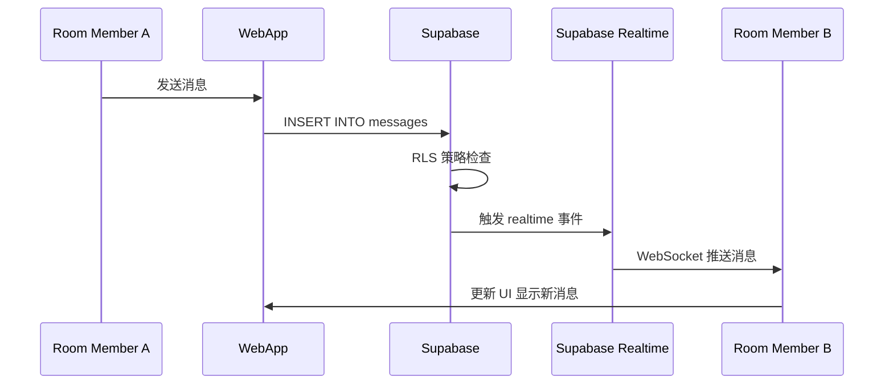
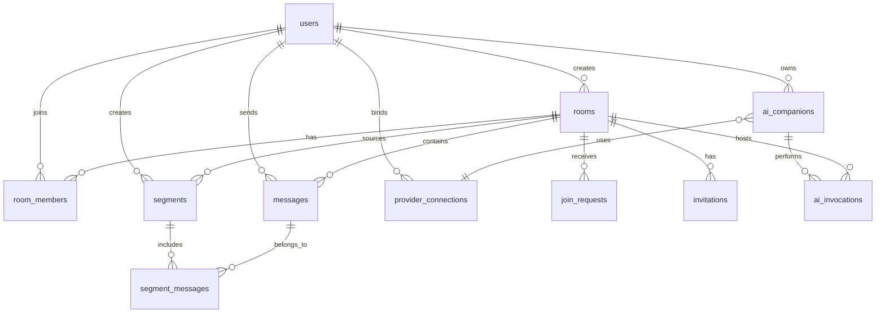
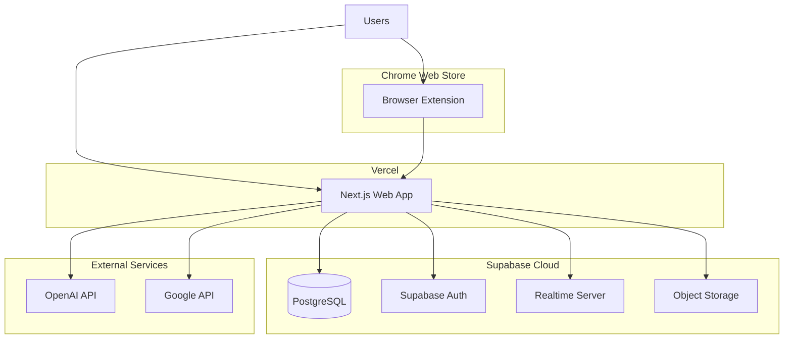

# 设计文档

## 概述

Pocket Room Sprint 1 是一个实时协作平台，融合了人类用户与 AI Companion（随从）的多方讨论能力。本设计实现了双重认证体系（门禁认证 + 服务商绑定）、实时消息系统、Companion 治理生命周期、Segment 摘取分享、以及浏览器扩展内容捕获等核心功能。

### 核心设计目标

1. **双重认证分离**：Gate Auth（用户身份认证）与 Provider Binding（AI 服务商授权）完全解耦
2. **资源可控的 AI 协作**：通过 Summon → Request → Approve → Respond 流程保护 token 资源
3. **隐私优先的消息可见性**：后加入成员仅能看到加入后的消息，通过 Segment 分享历史上下文
4. **灵活的 Room 加入策略**：支持申请审批、自由加入、密码加入三种互斥模式
5. **跨设备同步**：Web App 与 Browser Extension 的无缝数据同步

### 技术栈

- **前端框架**：Next.js 14 (App Router)
- **UI 组件**：shadcn/ui + Tailwind CSS
- **后端服务**：Supabase (PostgreSQL + Realtime + Auth + Storage)
- **浏览器扩展**：Vite + Manifest V3
- **实时通信**：Supabase Realtime (WebSocket)
- **认证协议**：OAuth 2.0 + PKCE (S256) + State 校验

## 架构

### 系统架构图



### 模块划分

#### 1. 认证模块 (Authentication Module)

**Gate Auth 子模块**
- 职责：用户身份认证与会话管理
- 技术：Supabase Auth + OAuth 2.0
- 支持的登录方式：Google OAuth、Email OTP、飞书 OAuth、微信登录

**Provider Binding 子模块**
- 职责：外部 AI 服务商账户绑定与 token 生命周期管理
- 技术：自实现 OAuth 2.0 客户端（PKCE + State 校验）
- 核心功能：
  - Authorization Code Flow + PKCE (S256)
  - Token 安全存储（加密）
  - 自动 Token 刷新
  - Token 撤销与解绑
  - HTTP 请求层自动注入 Authorization header

#### 2. Room 模块 (Room Module)

**Room 管理子模块**
- Room 创建与邀请确认机制
- 三种加入策略：申请审批、自由加入、密码加入
- Room 列表展示与实时状态更新

**消息子模块**
- 实时消息收发（Supabase Realtime）
- Markdown + 代码高亮 + 图片支持
- 消息删除与 Tombstone 机制
- 成员 Timeline 持久化（从加入时间点开始）

**成员管理子模块**
- 成员加入与退出
- 加入申请队列（Join Request Queue）
- 审批、拒绝、封禁、静默操作
- 后加入成员可见性规则

#### 3. Companion 模块 (Companion Module)

**Companion 注册与配置**
- 多 Companion 注册（无数量限制）
- 关联 Provider Binding 连接
- 模型选择与 System Prompt 配置

**Companion 治理生命周期**
- Summon（召唤）：进入待命状态，灰色图标
- Request（请求）：触发审批流程
- Approve（批准）：一次性批准 / 加入白名单
- Respond（响应）：执行 API 调用并输出

**上下文控制**
- 显式上下文选择（防止自动访问完整 Timeline）
- 回复可见范围控制（公开 / 私信）

#### 4. Segment 模块 (Segment Module)

**Segment 创建**
- 从同一 Room 选择连续消息
- 命名与描述
- 元数据记录（创建者、来源 Room、创建时间）

**Segment 分享**
- 分享到 Room（消息形式展示预览和链接）
- 私信分享
- 邀请时 Segment 分享（类似微信合并转发）

**Basket（收集篮）**
- 临时存储待整理的 Segment 草稿
- 浏览器扩展捕获内容的暂存区

#### 5. 浏览器扩展模块 (Browser Extension Module)

**内容捕获**
- 网页文本选择与捕获
- 来源 URL 记录
- 发送到 Basket 创建草稿 Segment

**同步机制**
- 与 Web App 的实时同步
- 登录状态检查

### 数据流

#### 用户登录流程（Gate Auth）



#### AI 服务商绑定流程（Provider Binding）



#### Companion 调用流程



#### 实时消息流程



## 组件与接口

### 前端组件架构

#### 页面组件

1. **LoginPage** (`/login`)
   - 展示多种登录方式（Google、Email OTP、飞书、微信）
   - 处理 OAuth 回调
   - 登录成功后重定向到 Room List

2. **RoomListPage** (`/rooms`)
   - 展示所有已建立的 Room
   - 实时更新活跃人数
   - 密码 Room 显示锁图标
   - 创建新 Room 入口

3. **RoomPage** (`/rooms/[id]`)
   - 实时消息 Timeline
   - 消息输入框（Markdown 编辑器）
   - 成员列表
   - Companion 召唤与管理
   - Segment 创建入口

4. **SettingsPage** (`/settings`)
   - Provider Binding 管理
   - Companion 注册与配置
   - 个人资料设置

5. **BasketPage** (`/basket`)
   - 展示草稿 Segment 列表
   - 整理与编辑 Segment
   - 分享到 Room 或私信

#### 核心 UI 组件

1. **MessageItem**
   - Props: `message`, `isOwn`, `showAvatar`
   - 支持 Markdown 渲染
   - 代码块语法高亮
   - 图片内联显示
   - Tombstone 状态显示

2. **CompanionCard**
   - Props: `companion`, `status` (待命/活跃)
   - 显示 Companion 名称、图标、状态
   - 状态颜色：灰色（待命）、明亮（活跃）

3. **JoinRequestItem**
   - Props: `request`, `onApprove`, `onReject`, `onBlock`, `onSilence`
   - 展示申请者信息
   - 操作按钮组

4. **SegmentPreview**
   - Props: `segment`, `onClick`
   - 展示 Segment 名称、描述、消息数量
   - 点击展开完整内容

### 后端接口设计

#### Supabase Edge Functions

1. **create-room**
   - 输入：`{ name, description, join_strategy, passcode?, invitees[] }`
   - 输出：`{ room_id, invitations[] }`
   - 逻辑：
     - 创建 Room 记录（状态：pending）
     - 创建 Invitation 记录
     - 发送邀请通知

2. **confirm-invitation**
   - 输入：`{ invitation_id, accept: boolean }`
   - 输出：`{ success: boolean, room_id? }`
   - 逻辑：
     - 更新 Invitation 状态
     - 如果接受：将创建者和被邀请人设为 Room Member，Room 状态改为 active
     - 如果拒绝：通知创建者，取消 Room 创建

3. **join-room**
   - 输入：`{ room_id, passcode? }`
   - 输出：`{ success: boolean, requires_approval?: boolean }`
   - 逻辑：
     - 检查 Join Strategy
     - 自由加入：直接添加为 Member
     - 密码加入：验证密码后添加为 Member
     - 申请审批：创建 Join Request 记录，发送通知

4. **handle-join-request**
   - 输入：`{ request_id, action: 'approve' | 'reject' | 'block' | 'silence', silence_duration? }`
   - 输出：`{ success: boolean }`
   - 逻辑：
     - 更新 Join Request 状态
     - 如果批准：添加为 Room Member
     - 如果封禁：添加到黑名单
     - 如果静默：设置冷却期

5. **send-message**
   - 输入：`{ room_id, content, attachments? }`
   - 输出：`{ message_id }`
   - 逻辑：
     - 检查用户是否为 Room Member
     - 插入 Message 记录
     - Supabase Realtime 自动推送

6. **delete-message**
   - 输入：`{ message_id }`
   - 输出：`{ success: boolean }`
   - 逻辑：
     - 检查权限（仅消息发送者或 Room Owner）
     - 更新 Message 记录：`is_deleted = true`, `deleted_at = now()`

7. **create-segment**
   - 输入：`{ name, description, room_id, message_ids[] }`
   - 输出：`{ segment_id }`
   - 逻辑：
     - 创建 Segment 记录
     - 创建 Segment_Messages 关联记录（保留顺序）

8. **share-segment**
   - 输入：`{ segment_id, target_type: 'room' | 'dm', target_id }`
   - 输出：`{ success: boolean }`
   - 逻辑：
     - 如果分享到 Room：创建特殊类型的 Message（包含 Segment 预览）
     - 如果私信：创建 DM 记录（Sprint 1 简化实现）

9. **summon-companion**
   - 输入：`{ room_id, companion_id }`
   - 输出：`{ success: boolean }`
   - 逻辑：
     - 检查 Companion 所有权
     - 创建 AI_Invocation 记录（状态：summoned）
     - 通知 Room 成员

10. **request-companion**
    - 输入：`{ room_id, companion_id, context_message_ids? }`
    - 输出：`{ invocation_id }`
    - 逻辑：
      - 创建 AI_Invocation 记录（状态：pending_approval）
      - 通知 Companion Owner

11. **approve-companion-request**
    - 输入：`{ invocation_id, approval_type: 'once' | 'whitelist' }`
    - 输出：`{ success: boolean }`
    - 逻辑：
      - 更新 AI_Invocation 状态为 processing
      - 如果是 whitelist：添加到白名单
      - 请求 Owner 选择上下文

12. **execute-companion-response**
    - 输入：`{ invocation_id, context_segment_id?, visibility: 'public' | 'private' }`
    - 输出：`{ message_id }`
    - 逻辑：
      - 获取 Companion 配置（model, system_prompt）
      - 获取上下文内容
      - 调用 AI Provider API（通过 Provider Binding 自动注入 token）
      - 创建 Message 记录
      - 更新 AI_Invocation 状态为 completed

#### OAuth Service 接口

```typescript
interface AuthProvider {
  // 发起登录流程
  startLogin(): Promise<{ authUrl: string, state: string }>;
  
  // 处理回调
  handleCallback(code: string, state: string, codeVerifier: string): Promise<Connection>;
  
  // 刷新 token
  refresh(connection: Connection): Promise<Connection>;
  
  // 获取当前有效的 access token
  getAccessToken(connectionId: string): Promise<string>;
  
  // 注入认证信息到 HTTP 请求
  injectAuth(request: Request, connectionId: string): Promise<Request>;
  
  // 撤销连接
  revoke(connectionId: string): Promise<void>;
}

interface Connection {
  id: string;
  userId: string;
  provider: string; // 'openai' | 'google' | 'feishu' | 'wechat'
  accountId?: string;
  scopes: string[];
  accessToken: string; // 加密存储
  refreshToken?: string; // 加密存储
  expiresAt: Date;
  metadata: Record<string, any>;
  createdAt: Date;
  updatedAt: Date;
}

interface AuthService {
  // 连接新的 Provider
  connect(provider: string): Promise<Connection>;
  
  // 断开连接
  disconnect(connectionId: string): Promise<void>;
  
  // 列出所有连接
  listConnections(userId: string): Promise<Connection[]>;
  
  // 获取统一的 HTTP 客户端（自动处理认证）
  getClient(connectionId: string): Promise<HttpClient>;
}
```

### 数据库 RLS 策略

#### rooms 表

```sql
-- 所有已登录用户可以查看已建立的 Room（状态为 active）
CREATE POLICY "Anyone can view active rooms"
  ON public.rooms FOR SELECT
  USING (status = 'active');

-- Room Owner 可以管理自己的 Room
CREATE POLICY "Owners manage their rooms"
  ON public.rooms FOR ALL
  USING (owner_id = auth.uid());
```

#### messages 表

```sql
-- Room Member 可以查看自己加入后的消息
CREATE POLICY "Members see messages after join"
  ON public.messages FOR SELECT
  USING (
    EXISTS (
      SELECT 1 FROM public.room_members
      WHERE room_members.room_id = messages.room_id
        AND room_members.user_id = auth.uid()
        AND messages.created_at >= room_members.joined_at
    )
  );

-- Room Member 可以发送消息
CREATE POLICY "Members can send messages"
  ON public.messages FOR INSERT
  WITH CHECK (
    EXISTS (
      SELECT 1 FROM public.room_members
      WHERE room_members.room_id = messages.room_id
        AND room_members.user_id = auth.uid()
    )
  );

-- 用户可以删除自己的消息
CREATE POLICY "Users can delete own messages"
  ON public.messages FOR UPDATE
  USING (user_id = auth.uid())
  WITH CHECK (user_id = auth.uid());
```

#### room_members 表

```sql
-- Room Member 可以查看同一 Room 的其他成员
CREATE POLICY "Members see other members"
  ON public.room_members FOR SELECT
  USING (
    EXISTS (
      SELECT 1 FROM public.room_members rm
      WHERE rm.room_id = room_members.room_id
        AND rm.user_id = auth.uid()
    )
  );
```

#### join_requests 表

```sql
-- 申请者可以查看自己的申请
CREATE POLICY "Users see own requests"
  ON public.join_requests FOR SELECT
  USING (user_id = auth.uid());

-- Room Owner 可以查看自己 Room 的申请
CREATE POLICY "Owners see room requests"
  ON public.join_requests FOR SELECT
  USING (
    EXISTS (
      SELECT 1 FROM public.rooms
      WHERE rooms.id = join_requests.room_id
        AND rooms.owner_id = auth.uid()
    )
  );

-- 用户可以创建加入申请
CREATE POLICY "Users can create requests"
  ON public.join_requests FOR INSERT
  WITH CHECK (user_id = auth.uid());
```

#### segments 表

```sql
-- Segment 创建者可以管理自己的 Segment
CREATE POLICY "Creators manage segments"
  ON public.segments FOR ALL
  USING (created_by = auth.uid());

-- Room Member 可以查看分享到 Room 的 Segment
CREATE POLICY "Members see shared segments"
  ON public.segments FOR SELECT
  USING (
    is_shared_to_room = true
    AND EXISTS (
      SELECT 1 FROM public.room_members
      WHERE room_members.room_id = segments.room_id
        AND room_members.user_id = auth.uid()
    )
  );
```

#### ai_familiars 表

```sql
-- 用户管理自己的 Companion
CREATE POLICY "Users manage own companions"
  ON public.ai_familiars FOR ALL
  USING (owner_id = auth.uid());

-- 所有人可以查看 Companion（用于 Room 中展示）
CREATE POLICY "Everyone can see companions"
  ON public.ai_familiars FOR SELECT
  USING (true);
```

#### ai_invocations 表

```sql
-- Room Member 可以查看 Room 中的 Invocation
CREATE POLICY "Members see room invocations"
  ON public.ai_invocations FOR SELECT
  USING (
    EXISTS (
      SELECT 1 FROM public.room_members
      WHERE room_members.room_id = ai_invocations.room_id
        AND room_members.user_id = auth.uid()
    )
  );

-- 触发者可以创建 Invocation
CREATE POLICY "Triggerer can create invocation"
  ON public.ai_invocations FOR INSERT
  WITH CHECK (triggered_by = auth.uid());

-- Companion Owner 可以更新 Invocation（审批）
CREATE POLICY "Owner can approve invocation"
  ON public.ai_invocations FOR UPDATE
  USING (
    EXISTS (
      SELECT 1 FROM public.ai_familiars
      WHERE ai_familiars.id = ai_invocations.familiar_id
        AND ai_familiars.owner_id = auth.uid()
    )
  );
```


## 数据模型

### 核心实体关系图



### 数据表设计

#### 1. users（用户表）

由 Supabase Auth 管理，扩展字段：

```sql
-- 扩展 auth.users 的 metadata
{
  "display_name": "用户显示名称",
  "avatar_url": "头像 URL",
  "created_at": "注册时间"
}
```

#### 2. rooms（Room 表）

```sql
CREATE TABLE public.rooms (
  id UUID DEFAULT gen_random_uuid() PRIMARY KEY,
  name TEXT NOT NULL,
  description TEXT,
  owner_id UUID REFERENCES auth.users(id) NOT NULL,
  
  -- 加入策略（三选一）
  join_strategy TEXT CHECK (join_strategy IN ('approval', 'free', 'passcode')) DEFAULT 'approval',
  passcode_hash TEXT, -- 仅当 join_strategy = 'passcode' 时有值，使用 bcrypt 加密
  
  -- Room 状态
  status TEXT CHECK (status IN ('pending', 'active', 'archived')) DEFAULT 'pending',
  -- pending: 等待被邀请人确认
  -- active: 已建立，可正常使用
  -- archived: 已归档
  
  is_public BOOLEAN DEFAULT TRUE, -- 是否在 Room List 中可见
  
  created_at TIMESTAMPTZ DEFAULT NOW() NOT NULL,
  updated_at TIMESTAMPTZ DEFAULT NOW() NOT NULL
);

CREATE INDEX idx_rooms_status ON public.rooms(status);
CREATE INDEX idx_rooms_owner ON public.rooms(owner_id);
```

#### 3. invitations（邀请表）

```sql
CREATE TABLE public.invitations (
  id UUID DEFAULT gen_random_uuid() PRIMARY KEY,
  room_id UUID REFERENCES public.rooms(id) ON DELETE CASCADE NOT NULL,
  inviter_id UUID REFERENCES auth.users(id) NOT NULL,
  invitee_id UUID REFERENCES auth.users(id) NOT NULL,
  
  status TEXT CHECK (status IN ('pending', 'accepted', 'rejected')) DEFAULT 'pending',
  
  -- 邀请时分享的 Segment（可选）
  invitation_segment_id UUID REFERENCES public.segments(id) ON DELETE SET NULL,
  
  created_at TIMESTAMPTZ DEFAULT NOW() NOT NULL,
  responded_at TIMESTAMPTZ,
  
  UNIQUE(room_id, invitee_id)
);

CREATE INDEX idx_invitations_invitee ON public.invitations(invitee_id, status);
```

#### 4. room_members（Room 成员表）

```sql
CREATE TABLE public.room_members (
  room_id UUID REFERENCES public.rooms(id) ON DELETE CASCADE NOT NULL,
  user_id UUID REFERENCES auth.users(id) ON DELETE CASCADE NOT NULL,
  
  role TEXT CHECK (role IN ('owner', 'member')) DEFAULT 'member',
  
  -- 加入时间（决定可见消息的起点）
  joined_at TIMESTAMPTZ DEFAULT NOW() NOT NULL,
  
  -- 退出时间（NULL 表示仍在 Room 中）
  left_at TIMESTAMPTZ,
  
  -- 是否保留消息历史（退出时选择）
  keep_history BOOLEAN DEFAULT TRUE,
  
  PRIMARY KEY (room_id, user_id)
);

CREATE INDEX idx_room_members_user ON public.room_members(user_id);
CREATE INDEX idx_room_members_room_active ON public.room_members(room_id) WHERE left_at IS NULL;
```

#### 5. join_requests（加入申请表）

```sql
CREATE TABLE public.join_requests (
  id UUID DEFAULT gen_random_uuid() PRIMARY KEY,
  room_id UUID REFERENCES public.rooms(id) ON DELETE CASCADE NOT NULL,
  user_id UUID REFERENCES auth.users(id) ON DELETE CASCADE NOT NULL,
  
  status TEXT CHECK (status IN ('pending', 'approved', 'rejected', 'blocked')) DEFAULT 'pending',
  
  -- 静默冷却期（如果 Room Owner 选择静默）
  silenced_until TIMESTAMPTZ,
  
  created_at TIMESTAMPTZ DEFAULT NOW() NOT NULL,
  handled_at TIMESTAMPTZ,
  handled_by UUID REFERENCES auth.users(id),
  
  UNIQUE (room_id, user_id)
);

CREATE INDEX idx_join_requests_room_pending ON public.join_requests(room_id, status);
```

#### 6. room_blacklist（Room 黑名单表）

```sql
CREATE TABLE public.room_blacklist (
  room_id UUID REFERENCES public.rooms(id) ON DELETE CASCADE NOT NULL,
  user_id UUID REFERENCES auth.users(id) ON DELETE CASCADE NOT NULL,
  blocked_by UUID REFERENCES auth.users(id) NOT NULL,
  blocked_at TIMESTAMPTZ DEFAULT NOW() NOT NULL,
  reason TEXT,
  
  PRIMARY KEY (room_id, user_id)
);
```

#### 7. messages（消息表）

```sql
CREATE TABLE public.messages (
  id UUID DEFAULT gen_random_uuid() PRIMARY KEY,
  room_id UUID REFERENCES public.rooms(id) ON DELETE CASCADE NOT NULL,
  user_id UUID REFERENCES auth.users(id) NOT NULL,
  
  -- 消息内容（Markdown 格式）
  content TEXT NOT NULL,
  
  -- 消息类型
  message_type TEXT CHECK (message_type IN ('text', 'segment_share', 'system')) DEFAULT 'text',
  
  -- 如果是 segment_share 类型，关联的 Segment
  shared_segment_id UUID REFERENCES public.segments(id) ON DELETE SET NULL,
  
  -- 附件（图片 URL 数组，存储在 Supabase Storage）
  attachments JSONB DEFAULT '[]'::jsonb,
  
  -- 删除标记
  is_deleted BOOLEAN DEFAULT FALSE,
  deleted_at TIMESTAMPTZ,
  
  created_at TIMESTAMPTZ DEFAULT NOW() NOT NULL,
  updated_at TIMESTAMPTZ DEFAULT NOW() NOT NULL
);

CREATE INDEX idx_messages_room_time ON public.messages(room_id, created_at DESC);
CREATE INDEX idx_messages_user ON public.messages(user_id);
```

#### 8. segments（Segment 表）

```sql
CREATE TABLE public.segments (
  id UUID DEFAULT gen_random_uuid() PRIMARY KEY,
  name TEXT NOT NULL,
  description TEXT,
  
  created_by UUID REFERENCES auth.users(id) NOT NULL,
  room_id UUID REFERENCES public.rooms(id) ON DELETE CASCADE NOT NULL,
  
  -- 是否分享到 Room
  is_shared_to_room BOOLEAN DEFAULT FALSE,
  
  -- 是否为草稿（在 Basket 中）
  is_draft BOOLEAN DEFAULT FALSE,
  
  -- 如果是从浏览器扩展捕获的，记录来源 URL
  source_url TEXT,
  
  created_at TIMESTAMPTZ DEFAULT NOW() NOT NULL,
  updated_at TIMESTAMPTZ DEFAULT NOW() NOT NULL
);

CREATE INDEX idx_segments_creator ON public.segments(created_by);
CREATE INDEX idx_segments_room ON public.segments(room_id);
CREATE INDEX idx_segments_draft ON public.segments(created_by, is_draft) WHERE is_draft = TRUE;
```

#### 9. segment_messages（Segment 消息关联表）

```sql
CREATE TABLE public.segment_messages (
  segment_id UUID REFERENCES public.segments(id) ON DELETE CASCADE NOT NULL,
  message_id UUID REFERENCES public.messages(id) ON DELETE CASCADE NOT NULL,
  
  -- 消息在 Segment 中的顺序
  message_order INT NOT NULL,
  
  PRIMARY KEY (segment_id, message_id)
);

CREATE INDEX idx_segment_messages_order ON public.segment_messages(segment_id, message_order);
```

#### 10. provider_connections（Provider 连接表）

```sql
CREATE TABLE public.provider_connections (
  id UUID DEFAULT gen_random_uuid() PRIMARY KEY,
  user_id UUID REFERENCES auth.users(id) ON DELETE CASCADE NOT NULL,
  
  -- Provider 类型
  provider TEXT CHECK (provider IN ('openai', 'google', 'anthropic')) NOT NULL,
  
  -- 外部账户 ID（如果 Provider 提供）
  account_id TEXT,
  
  -- OAuth scopes
  scopes TEXT[] NOT NULL,
  
  -- 加密存储的 tokens（使用 Supabase Vault 或应用层加密）
  access_token_encrypted TEXT NOT NULL,
  refresh_token_encrypted TEXT,
  
  -- Token 过期时间
  expires_at TIMESTAMPTZ NOT NULL,
  
  -- 额外的 Provider 特定元数据
  metadata JSONB DEFAULT '{}'::jsonb,
  
  created_at TIMESTAMPTZ DEFAULT NOW() NOT NULL,
  updated_at TIMESTAMPTZ DEFAULT NOW() NOT NULL,
  
  UNIQUE(user_id, provider, account_id)
);

CREATE INDEX idx_provider_connections_user ON public.provider_connections(user_id);
```

#### 11. ai_companions（AI Companion 表）

```sql
CREATE TABLE public.ai_companions (
  id UUID DEFAULT gen_random_uuid() PRIMARY KEY,
  name TEXT NOT NULL,
  owner_id UUID REFERENCES auth.users(id) ON DELETE CASCADE NOT NULL,
  
  -- 关联的 Provider Connection
  provider_connection_id UUID REFERENCES public.provider_connections(id) ON DELETE CASCADE NOT NULL,
  
  -- 模型选择
  model TEXT NOT NULL, -- 'gpt-4', 'gpt-3.5-turbo', 'gemini-pro', etc.
  
  -- System Prompt（定义人格和语气）
  system_prompt TEXT,
  
  -- 模型参数
  temperature FLOAT DEFAULT 0.7,
  max_tokens INT DEFAULT 2000,
  
  created_at TIMESTAMPTZ DEFAULT NOW() NOT NULL,
  updated_at TIMESTAMPTZ DEFAULT NOW() NOT NULL
);

CREATE INDEX idx_ai_companions_owner ON public.ai_companions(owner_id);
```

#### 12. companion_whitelist（Companion 白名单表）

```sql
CREATE TABLE public.companion_whitelist (
  companion_id UUID REFERENCES public.ai_companions(id) ON DELETE CASCADE NOT NULL,
  user_id UUID REFERENCES auth.users(id) ON DELETE CASCADE NOT NULL,
  room_id UUID REFERENCES public.rooms(id) ON DELETE CASCADE NOT NULL,
  
  added_at TIMESTAMPTZ DEFAULT NOW() NOT NULL,
  
  PRIMARY KEY (companion_id, user_id, room_id)
);
```

#### 13. ai_invocations（AI 调用记录表）

```sql
CREATE TABLE public.ai_invocations (
  id UUID DEFAULT gen_random_uuid() PRIMARY KEY,
  companion_id UUID REFERENCES public.ai_companions(id) ON DELETE CASCADE NOT NULL,
  room_id UUID REFERENCES public.rooms(id) ON DELETE CASCADE NOT NULL,
  
  -- 触发者（可能是 Owner 或其他成员）
  triggered_by UUID REFERENCES auth.users(id) NOT NULL,
  
  -- 批准者（如果需要审批）
  approved_by UUID REFERENCES auth.users(id),
  
  -- 显式选择的上下文 Segment
  context_segment_id UUID REFERENCES public.segments(id) ON DELETE SET NULL,
  
  -- 生成的响应消息
  response_message_id UUID REFERENCES public.messages(id) ON DELETE SET NULL,
  
  -- 调用状态
  status TEXT CHECK (status IN (
    'summoned',          -- 已召唤，待命状态
    'pending_approval',  -- 等待 Owner 批准
    'processing',        -- 正在调用 API
    'completed',         -- 已完成
    'rejected',          -- Owner 拒绝
    'failed'             -- API 调用失败
  )) DEFAULT 'summoned',
  
  -- 回复可见范围
  visibility TEXT CHECK (visibility IN ('public', 'private')) DEFAULT 'public',
  
  -- Token 消耗统计
  tokens_used INT,
  
  -- 错误信息（如果失败）
  error_message TEXT,
  
  created_at TIMESTAMPTZ DEFAULT NOW() NOT NULL,
  completed_at TIMESTAMPTZ
);

CREATE INDEX idx_ai_invocations_room ON public.ai_invocations(room_id, created_at DESC);
CREATE INDEX idx_ai_invocations_companion ON public.ai_invocations(companion_id);
CREATE INDEX idx_ai_invocations_status ON public.ai_invocations(status) WHERE status IN ('pending_approval', 'processing');
```

### 数据模型更新说明

相比现有的 `docs/db.sql`，本设计新增或修改了以下表：

**新增表：**
1. `invitations` - 支持邀请确认机制
2. `room_blacklist` - 支持封禁功能
3. `provider_connections` - 管理 OAuth Provider 绑定
4. `companion_whitelist` - 支持白名单自动批准

**修改表：**
1. `rooms` - 新增 `join_strategy`, `passcode_hash`, `status` 字段
2. `room_members` - 新增 `left_at`, `keep_history` 字段，支持退出语义
3. `join_requests` - 新增 `silenced_until` 字段，支持静默操作
4. `messages` - 新增 `message_type`, `shared_segment_id`, `attachments` 字段
5. `segments` - 新增 `is_draft`, `source_url` 字段，支持 Basket 和浏览器扩展
6. `ai_companions` - 重命名自 `ai_familiars`，新增 `provider_connection_id`, `temperature`, `max_tokens` 字段
7. `ai_invocations` - 新增 `visibility`, `tokens_used`, `error_message` 字段，扩展 `status` 枚举


## 正确性属性

*属性（Property）是一个特征或行为，应该在系统的所有有效执行中保持为真——本质上是关于系统应该做什么的形式化陈述。属性是人类可读规范与机器可验证正确性保证之间的桥梁。*

### 属性反思

在将验收标准转换为可测试属性之前，我们需要识别并消除冗余：

**冗余分析：**

1. **认证相关属性**：
   - 1.5（任意登录方式创建会话）和 1.7（未登录重定向）可以合并为一个认证状态属性
   - 保留：统一的认证状态检查属性

2. **Provider Binding 属性**：
   - 2.1（OAuth 流程）、2.2（PKCE/State）、2.7（自动注入 token）是 OAuth 实现的不同方面，应该保持独立
   - 2.4（自动刷新）和 2.6（撤销）是 token 生命周期的不同阶段，应该保持独立

3. **Room 创建属性**：
   - 3.1（至少一人）、3.2（选择策略）、3.3（密码策略需要密码）都是创建验证的不同方面，可以合并为一个综合验证属性
   - 保留：Room 创建输入验证属性

4. **加入策略属性**：
   - 5.3（批准）、5.4（拒绝）、5.5（封禁）、5.6（静默）是审批操作的不同结果，应该保持独立
   - 5.8（被邀请人跳过审批）、7.4（被邀请人跳过密码）可以合并为一个"被邀请人特权"属性

5. **消息可见性属性**：
   - 9.2（仅看加入后消息）和 9.3（阻止访问加入前消息）是同一规则的两面，可以合并
   - 保留：后加入成员消息可见性属性

6. **Companion 生命周期属性**：
   - 14.1（召唤）、14.2（请求）、14.3（静默）、14.5（响应）是生命周期的不同阶段，应该保持独立
   - 14.7（白名单自动批准）和 14.8（Owner 跳过审批）可以合并为一个"审批豁免"属性

7. **RLS 安全属性**：
   - 17.2（非成员不能读消息）、17.3（只能管理自己的资源）、17.4（invocation 可见性）是不同资源的 RLS 规则，应该保持独立

### 正确性属性列表

#### 属性 1：认证状态一致性

*对于任意*用户和任意受保护的页面，当且仅当用户已通过 Gate Auth 认证时，用户才能访问该页面；否则应该被重定向到登录页面。

**验证需求：1.5, 1.7**

#### 属性 2：会话持久化

*对于任意*已认证用户，关闭浏览器后重新打开，用户会话应该仍然有效，无需重新登录。

**验证需求：1.6**

#### 属性 3：OAuth PKCE 完整性

*对于任意*Provider Binding OAuth 流程，授权请求必须包含 code_challenge（S256 算法）和 state 参数，回调处理必须验证 state 匹配并使用 code_verifier 交换 token。

**验证需求：2.2**

#### 属性 4：Token 安全存储

*对于任意*存储的 Provider Connection，access_token 和 refresh_token 必须以加密形式存储，且不应该以明文形式出现在任何日志中。

**验证需求：2.3**

#### 属性 5：Token 自动刷新

*对于任意*即将过期的 access_token（距离过期时间小于 2 分钟），系统应该自动使用 refresh_token 刷新 token，并更新存储的 expires_at 时间。

**验证需求：2.4**

#### 属性 6：HTTP 请求自动注入认证

*对于任意*通过 Provider Binding 发起的 AI API 调用，HTTP 请求必须自动包含 `Authorization: Bearer <access_token>` header，业务层代码不应该手动处理 token。

**验证需求：2.7**

#### 属性 7：多 Provider 绑定

*对于任意*用户，应该能够同时绑定多个不同的 AI Provider 账户（OpenAI、Google 等），每个绑定独立管理 token 生命周期。

**验证需求：2.9**

#### 属性 8：Room 创建输入验证

*对于任意*Room 创建请求，必须满足以下条件：(1) 至少邀请一名用户，(2) 指定一种 Join_Strategy，(3) 如果选择密码策略，必须提供 passcode；否则创建应该被拒绝。

**验证需求：3.1, 3.2, 3.3**

#### 属性 9：Pending Room 不可见

*对于任意*状态为 pending 的 Room（等待被邀请人确认），该 Room 不应该出现在任何用户的 Room List 中，包括创建者。

**验证需求：3.4**

#### 属性 10：邀请确认创建成员

*对于任意*被接受的邀请，系统应该同时将创建者和被邀请人添加为 Room Member，并将 Room 状态更新为 active。

**验证需求：3.5**

#### 属性 11：邀请永久有效

*对于任意*创建的邀请，在被明确接受或拒绝之前，应该保持 pending 状态，不应该因为时间流逝而自动过期。

**验证需求：3.6**

#### 属性 12：邀请拒绝取消 Room

*对于任意*被拒绝的邀请，系统应该通知 Room 创建者，并将 Room 状态更新为 archived 或删除 Room 记录。

**验证需求：3.7**

#### 属性 13：Active Room 全局可见

*对于任意*状态为 active 的 Room，所有已登录用户都应该能够在 Room List 中看到该 Room（密码 Room 仅显示名称和锁图标）。

**验证需求：4.1**

#### 属性 14：密码 Room 信息隐藏

*对于任意*join_strategy 为 'passcode' 的 Room，Room List 应该仅显示 Room 名称和锁图标，不应该显示描述、成员列表或活跃人数。

**验证需求：4.3**

#### 属性 15：加入申请创建记录

*对于任意*对申请审批模式 Room 的加入请求，系统应该创建一条 join_request 记录（status = 'pending'）并向 Room Owner 发送通知。

**验证需求：5.1**

#### 属性 16：批准申请创建成员

*对于任意*被批准的 join_request，系统应该创建 room_member 记录，将 join_request 状态更新为 'approved'，并通知申请者。

**验证需求：5.3**

#### 属性 17：封禁阻止重复申请

*对于任意*被封禁的用户（存在 room_blacklist 记录），该用户对同一 Room 的后续加入申请应该被立即拒绝。

**验证需求：5.5**

#### 属性 18：静默冷却期限制

*对于任意*被静默的用户（join_request.silenced_until 未过期），该用户在冷却期内对同一 Room 的加入申请应该被拒绝。

**验证需求：5.6**

#### 属性 19：被邀请人加入特权

*对于任意*通过邀请加入 Room 的用户，应该跳过所有加入验证（审批、密码验证），直接创建 room_member 记录。

**验证需求：5.8, 7.4**

#### 属性 20：自由加入立即成员

*对于任意*join_strategy 为 'free' 的 Room，用户的加入请求应该立即创建 room_member 记录，无需创建 join_request 或等待审批。

**验证需求：6.1**

#### 属性 21：密码验证加入

*对于任意*join_strategy 为 'passcode' 的 Room，当且仅当用户提供的密码与 Room 的 passcode_hash 匹配时，才应该创建 room_member 记录。

**验证需求：7.2, 7.3**

#### 属性 22：Markdown 渲染完整性

*对于任意*包含 Markdown 语法的消息内容，渲染后的 HTML 应该正确反映 Markdown 语义（标题、列表、链接、强调等）。

**验证需求：8.2**

#### 属性 23：代码块语法高亮

*对于任意*包含代码块（```language）的消息，渲染后应该应用语法高亮，且语言标识应该正确识别。

**验证需求：8.3**

#### 属性 24：消息删除 Tombstone

*对于任意*被删除的消息，系统应该设置 is_deleted = true 和 deleted_at 时间戳，而不是物理删除记录；查询时应该显示 Tombstone 占位符。

**验证需求：8.5**

#### 属性 25：消息持久化

*对于任意*Room Member 发送的消息，应该被持久化存储在 messages 表中，且该成员在任何设备上登录都能看到自己的消息历史。

**验证需求：9.1**

#### 属性 26：后加入成员消息可见性

*对于任意*Room Member，该成员只能查询和访问 created_at >= joined_at 的消息；任何尝试访问加入前消息的查询应该被 RLS 策略阻止。

**验证需求：9.2, 9.3**

#### 属性 27：邀请 Segment 关联

*对于任意*包含 Segment 的邀请，invitation 记录应该包含 invitation_segment_id 字段，且该 Segment 应该遵循普通 Segment 的元数据规则（created_by、room_id、created_at）。

**验证需求：10.2, 10.4**

#### 属性 28：退出保留历史

*对于任意*选择保留历史的退出操作，系统应该设置 room_member.left_at = now() 和 keep_history = true，该成员的消息历史应该保持可访问。

**验证需求：11.4**

#### 属性 29：退出删除历史

*对于任意*选择删除历史的退出操作，系统应该设置 room_member.left_at = now() 和 keep_history = false，该成员的消息历史应该被标记为不可访问。

**验证需求：11.5**

#### 属性 30：Segment 创建保序

*对于任意*Segment 创建请求，系统应该创建 segment 记录和对应的 segment_messages 记录，且 message_order 字段应该保留消息的原始时间顺序。

**验证需求：12.1, 12.3**

#### 属性 31：Segment 单 Room 限制

*对于任意*Segment 创建请求，如果选中的消息来自不同的 Room，创建应该被拒绝；Segment 只能包含同一 room_id 的消息。

**验证需求：12.2**

#### 属性 32：Segment 分享创建消息

*对于任意*分享到 Room 的 Segment，系统应该创建一条 message_type = 'segment_share' 的消息，包含 shared_segment_id 引用。

**验证需求：12.4**

#### 属性 33：Segment 元数据完整性

*对于任意*Segment，必须包含 created_by（创建者）、room_id（来源 Room）、created_at（创建时间）字段，且这些字段不应该为空。

**验证需求：12.6**

#### 属性 34：多 Companion 注册

*对于任意*用户，应该能够创建多个 ai_companion 记录，每个记录关联不同的 provider_connection_id 和 model，无数量限制。

**验证需求：13.1**

#### 属性 35：Companion 需要有效连接

*对于任意*Companion 创建或更新请求，provider_connection_id 必须引用一个有效的、属于该用户的 provider_connection 记录；否则操作应该被拒绝。

**验证需求：13.2**

#### 属性 36：Companion 召唤创建 Invocation

*对于任意*Companion Owner 在 Room 中的召唤操作，系统应该创建一条 ai_invocation 记录（status = 'summoned'），不应该触发任何 API 调用或 token 消耗。

**验证需求：14.1**

#### 属性 37：Companion 请求等待审批

*对于任意*Room Member 对已召唤 Companion 的请求，系统应该创建或更新 ai_invocation 记录（status = 'pending_approval'），并向 Companion Owner 发送通知，不应该触发 API 调用。

**验证需求：14.2, 14.3**

#### 属性 38：Companion 批准触发响应

*对于任意*被批准的 Companion 请求，系统应该：(1) 更新 invocation status 为 'processing'，(2) 使用显式选择的上下文调用 AI API，(3) 创建包含响应的 message 记录，(4) 更新 invocation status 为 'completed'。

**验证需求：14.5**

#### 属性 39：Companion 审批豁免

*对于任意*Companion 请求，如果 (1) 触发者是 Companion Owner 本人，或 (2) 触发者在该 Companion 的白名单中（companion_whitelist 记录存在），则应该跳过审批流程，直接执行 API 调用。

**验证需求：14.7, 14.8**

#### 属性 40：Companion 上下文显式选择

*对于任意*Companion API 调用，发送给 AI Provider 的上下文必须仅包含 Companion Owner 显式选择的消息或 Segment（通过 context_segment_id 引用），不应该自动包含 Room 的完整 Timeline。

**验证需求：15.2**

#### 属性 41：Companion 响应可见性控制

*对于任意*Companion 响应，如果 invocation.visibility = 'private'，则生成的 message 应该仅对 Companion Owner 可见；如果 visibility = 'public'，则对所有 Room Member 可见。

**验证需求：15.3**

#### 属性 42：浏览器扩展创建草稿 Segment

*对于任意*通过浏览器扩展捕获的内容，系统应该在 Basket 中创建一条 segment 记录（is_draft = true），包含 source_url 字段记录来源网页。

**验证需求：16.2**

#### 属性 43：RLS 强制表级隔离

*对于任意*启用 RLS 的表（rooms、messages、room_members、segments、ai_companions、provider_connections），未授权用户的查询应该返回空结果集，不应该返回权限错误或泄露资源存在性。

**验证需求：17.1, 17.5**

#### 属性 44：消息 RLS 成员检查

*对于任意*messages 表的 SELECT 查询，RLS 策略应该确保：(1) 用户是 Room Member，(2) message.created_at >= room_member.joined_at；不满足条件的消息不应该出现在结果中。

**验证需求：17.2**

#### 属性 45：资源所有权 RLS

*对于任意*ai_companions 或 provider_connections 表的查询或修改操作，RLS 策略应该确保 owner_id = auth.uid()；用户不应该能够访问或修改其他用户的资源。

**验证需求：17.3**

#### 属性 46：Invocation RLS 成员检查

*对于任意*ai_invocations 表的 SELECT 查询，RLS 策略应该确保用户是对应 Room 的 Member；非成员不应该能够看到 Room 中的 Companion 调用记录。

**验证需求：17.4**


## 错误处理

### 错误分类

#### 1. 认证错误

**Gate Auth 错误**
- `AUTH_PROVIDER_UNAVAILABLE`: OAuth Provider 服务不可用
- `AUTH_CALLBACK_INVALID`: OAuth 回调参数无效或 state 不匹配
- `AUTH_SESSION_EXPIRED`: 用户会话已过期
- `AUTH_UNAUTHORIZED`: 用户未登录或无权限

**处理策略**：
- 显示用户友好的错误消息
- 提供重试选项
- 自动重定向到登录页面（对于 session 过期）

**Provider Binding 错误**
- `PROVIDER_OAUTH_FAILED`: OAuth 授权流程失败
- `PROVIDER_TOKEN_EXPIRED`: Access token 已过期且无法刷新
- `PROVIDER_TOKEN_INVALID`: Token 无效或已被撤销
- `PROVIDER_REFRESH_FAILED`: Refresh token 刷新失败

**处理策略**：
- 通知用户重新进行 OAuth 授权
- 记录错误日志（不包含 token 明文）
- 更新 provider_connection 状态为 'invalid'

#### 2. 业务逻辑错误

**Room 相关错误**
- `ROOM_NOT_FOUND`: Room 不存在或已被删除
- `ROOM_ACCESS_DENIED`: 用户无权访问该 Room
- `ROOM_ALREADY_MEMBER`: 用户已经是 Room 成员
- `ROOM_BLACKLISTED`: 用户已被该 Room 封禁
- `ROOM_SILENCED`: 用户在冷却期内，无法重新申请
- `ROOM_PASSCODE_INCORRECT`: 密码错误
- `ROOM_INVITATION_INVALID`: 邀请无效或已被处理

**处理策略**：
- 返回明确的错误消息
- 对于 access denied，不泄露 Room 是否存在
- 提供适当的用户操作建议

**Companion 相关错误**
- `COMPANION_NOT_FOUND`: Companion 不存在
- `COMPANION_NOT_OWNER`: 用户不是 Companion 的 Owner
- `COMPANION_NOT_SUMMONED`: Companion 未在 Room 中召唤
- `COMPANION_APPROVAL_REQUIRED`: 需要 Owner 批准
- `COMPANION_API_FAILED`: AI API 调用失败
- `COMPANION_CONTEXT_REQUIRED`: 需要显式选择上下文
- `COMPANION_PROVIDER_INVALID`: 关联的 Provider Connection 无效

**处理策略**：
- 向触发者和 Owner 显示错误信息
- 更新 ai_invocation 状态为 'failed'
- 记录 error_message 字段
- 不消耗 token（API 调用前验证）

**Segment 相关错误**
- `SEGMENT_CROSS_ROOM`: Segment 包含来自不同 Room 的消息
- `SEGMENT_MESSAGE_NOT_FOUND`: 选中的消息不存在或已被删除
- `SEGMENT_ACCESS_DENIED`: 用户无权访问 Segment 中的消息

**处理策略**：
- 返回明确的验证错误
- 阻止创建无效的 Segment

#### 3. 网络与连接错误

**Supabase Realtime 错误**
- `REALTIME_CONNECTION_LOST`: WebSocket 连接断开
- `REALTIME_RECONNECTING`: 正在重新连接
- `REALTIME_SUBSCRIPTION_FAILED`: 订阅 Room 频道失败

**处理策略**：
- 显示连接状态指示器
- 自动重连（指数退避）
- 连接恢复后同步消息（查询最新消息）

**AI Provider API 错误**
- `PROVIDER_API_TIMEOUT`: API 请求超时
- `PROVIDER_API_RATE_LIMIT`: 触发速率限制
- `PROVIDER_API_QUOTA_EXCEEDED`: Token 配额耗尽
- `PROVIDER_API_SERVER_ERROR`: Provider 服务器错误

**处理策略**：
- 记录详细错误信息到 ai_invocation.error_message
- 通知 Companion Owner 和触发者
- 对于 rate limit，建议稍后重试
- 对于 quota exceeded，建议检查账户余额

#### 4. 数据验证错误

**输入验证错误**
- `VALIDATION_REQUIRED_FIELD`: 必填字段缺失
- `VALIDATION_INVALID_FORMAT`: 格式不正确
- `VALIDATION_LENGTH_EXCEEDED`: 长度超出限制
- `VALIDATION_INVALID_ENUM`: 枚举值无效

**处理策略**：
- 前端表单验证（即时反馈）
- 后端二次验证（防止绕过）
- 返回具体的字段错误信息

**RLS 策略错误**
- `RLS_ACCESS_DENIED`: 行级安全策略拒绝访问
- `RLS_POLICY_VIOLATION`: 违反 RLS 策略

**处理策略**：
- 返回空结果集（不泄露资源存在性）
- 记录安全日志（可能的攻击尝试）

### 错误响应格式

所有 API 错误响应遵循统一格式：

```typescript
interface ErrorResponse {
  error: {
    code: string;           // 错误代码（如 'ROOM_ACCESS_DENIED'）
    message: string;        // 用户友好的错误消息
    details?: any;          // 额外的错误详情（开发环境）
    timestamp: string;      // ISO 8601 时间戳
    requestId?: string;     // 请求 ID（用于追踪）
  }
}
```

### 错误日志

**日志级别**：
- `ERROR`: 系统错误、API 调用失败、RLS 违规
- `WARN`: 业务逻辑错误、验证失败、连接问题
- `INFO`: 正常操作、状态变更
- `DEBUG`: 详细的调试信息（仅开发环境）

**敏感信息保护**：
- 不记录 access_token、refresh_token、passcode 明文
- 不记录完整的用户输入（可能包含敏感信息）
- 使用 token ID 或 hash 代替实际 token 值

### 错误恢复策略

**自动重试**：
- Token 刷新失败：最多重试 3 次，指数退避
- Realtime 连接断开：自动重连，最多 10 次
- AI API 调用超时：不自动重试（避免重复消耗 token）

**用户操作**：
- 提供"重试"按钮（对于可恢复的错误）
- 提供"重新登录"链接（对于认证错误）
- 提供"联系支持"链接（对于系统错误）

**降级策略**：
- Realtime 不可用时，降级为轮询模式（每 5 秒查询一次新消息）
- 图片上传失败时，允许纯文本消息发送
- Markdown 渲染失败时，显示原始文本

## 测试策略

### 双重测试方法

本项目采用单元测试和基于属性的测试（Property-Based Testing, PBT）相结合的方法，确保全面的代码覆盖和正确性验证。

**单元测试**：
- 验证具体示例和边缘情况
- 测试错误处理逻辑
- 测试组件集成点
- 快速反馈（秒级执行）

**基于属性的测试**：
- 验证通用属性在所有输入下成立
- 通过随机生成大量测试用例发现边缘情况
- 确保系统在各种条件下的正确性
- 每个属性测试至少运行 100 次迭代

### 测试框架选择

**前端测试**：
- 单元测试：Vitest + React Testing Library
- 属性测试：fast-check
- E2E 测试：Playwright

**后端测试**：
- 单元测试：Vitest
- 属性测试：fast-check
- 数据库测试：Supabase Test Helpers

### 属性测试配置

每个属性测试必须：
1. 运行至少 100 次迭代（配置 `numRuns: 100`）
2. 使用注释标记对应的设计属性
3. 使用 fast-check 的 arbitrary 生成器创建测试数据

**标记格式**：
```typescript
// Feature: sprint1-pocket-room, Property 26: 后加入成员消息可见性
// 对于任意 Room Member，该成员只能查询和访问 created_at >= joined_at 的消息
```

### 测试覆盖范围

#### 1. 认证模块测试

**单元测试**：
- Google OAuth 登录流程（示例）
- Email OTP 登录流程（示例）
- 飞书 OAuth 登录流程（示例）
- 微信登录流程（示例）
- Session 过期处理（边缘情况）
- 未登录重定向（边缘情况）

**属性测试**：
- 属性 1：认证状态一致性
- 属性 2：会话持久化

#### 2. Provider Binding 模块测试

**单元测试**：
- PKCE code_verifier 和 code_challenge 生成
- State 参数生成和验证
- Token 加密存储和解密
- OAuth 回调处理（成功和失败场景）

**属性测试**：
- 属性 3：OAuth PKCE 完整性
- 属性 4：Token 安全存储
- 属性 5：Token 自动刷新
- 属性 6：HTTP 请求自动注入认证
- 属性 7：多 Provider 绑定

#### 3. Room 模块测试

**单元测试**：
- Room 创建表单验证（缺少邀请人、缺少策略、密码策略缺少密码）
- 密码 hash 生成和验证
- 邀请确认流程（接受和拒绝）
- 加入申请审批流程（批准、拒绝、封禁、静默）

**属性测试**：
- 属性 8：Room 创建输入验证
- 属性 9：Pending Room 不可见
- 属性 10：邀请确认创建成员
- 属性 11：邀请永久有效
- 属性 12：邀请拒绝取消 Room
- 属性 13：Active Room 全局可见
- 属性 14：密码 Room 信息隐藏
- 属性 15：加入申请创建记录
- 属性 16：批准申请创建成员
- 属性 17：封禁阻止重复申请
- 属性 18：静默冷却期限制
- 属性 19：被邀请人加入特权
- 属性 20：自由加入立即成员
- 属性 21：密码验证加入

#### 4. 消息模块测试

**单元测试**：
- Markdown 渲染（标题、列表、链接、代码块）
- 代码块语法高亮（JavaScript、Python、SQL）
- 图片上传和显示
- 消息删除 Tombstone 显示
- Realtime 连接断开和重连

**属性测试**：
- 属性 22：Markdown 渲染完整性
- 属性 23：代码块语法高亮
- 属性 24：消息删除 Tombstone
- 属性 25：消息持久化
- 属性 26：后加入成员消息可见性

#### 5. Segment 模块测试

**单元测试**：
- Segment 创建（选择连续消息）
- 跨 Room 消息验证（应该拒绝）
- Segment 分享到 Room（创建 segment_share 消息）
- 邀请时 Segment 分享
- Basket 草稿管理

**属性测试**：
- 属性 27：邀请 Segment 关联
- 属性 28：退出保留历史
- 属性 29：退出删除历史
- 属性 30：Segment 创建保序
- 属性 31：Segment 单 Room 限制
- 属性 32：Segment 分享创建消息
- 属性 33：Segment 元数据完整性

#### 6. Companion 模块测试

**单元测试**：
- Companion 注册（关联 Provider Connection）
- System Prompt 配置
- 召唤流程（创建 summoned invocation）
- 请求流程（创建 pending_approval invocation）
- 批准流程（一次性和白名单）
- API 调用失败处理

**属性测试**：
- 属性 34：多 Companion 注册
- 属性 35：Companion 需要有效连接
- 属性 36：Companion 召唤创建 Invocation
- 属性 37：Companion 请求等待审批
- 属性 38：Companion 批准触发响应
- 属性 39：Companion 审批豁免
- 属性 40：Companion 上下文显式选择
- 属性 41：Companion 响应可见性控制

#### 7. 浏览器扩展测试

**单元测试**：
- 内容选择和捕获
- 登录状态检查
- 与 Web App 的通信
- 草稿 Segment 创建

**属性测试**：
- 属性 42：浏览器扩展创建草稿 Segment

#### 8. 安全与 RLS 测试

**单元测试**：
- 各表的 RLS 策略启用检查
- 未授权访问尝试（应该返回空结果）
- 跨用户资源访问尝试（应该被阻止）

**属性测试**：
- 属性 43：RLS 强制表级隔离
- 属性 44：消息 RLS 成员检查
- 属性 45：资源所有权 RLS
- 属性 46：Invocation RLS 成员检查

### 测试数据生成

使用 fast-check 的 arbitrary 生成器创建测试数据：

```typescript
// 用户生成器
const userArb = fc.record({
  id: fc.uuid(),
  email: fc.emailAddress(),
  display_name: fc.string({ minLength: 1, maxLength: 50 })
});

// Room 生成器
const roomArb = fc.record({
  id: fc.uuid(),
  name: fc.string({ minLength: 1, maxLength: 100 }),
  description: fc.option(fc.string({ maxLength: 500 })),
  join_strategy: fc.constantFrom('approval', 'free', 'passcode'),
  owner_id: fc.uuid()
});

// 消息生成器
const messageArb = fc.record({
  id: fc.uuid(),
  room_id: fc.uuid(),
  user_id: fc.uuid(),
  content: fc.string({ minLength: 1, maxLength: 5000 }),
  created_at: fc.date()
});

// Companion 生成器
const companionArb = fc.record({
  id: fc.uuid(),
  name: fc.string({ minLength: 1, maxLength: 50 }),
  owner_id: fc.uuid(),
  provider_connection_id: fc.uuid(),
  model: fc.constantFrom('gpt-4', 'gpt-3.5-turbo', 'gemini-pro'),
  system_prompt: fc.option(fc.string({ maxLength: 1000 }))
});
```

### 集成测试

**Supabase 集成测试**：
- 使用 Supabase Test Helpers 创建测试数据库
- 测试 RLS 策略在实际数据库中的行为
- 测试 Realtime 订阅和消息推送
- 测试 Edge Functions 的端到端流程

**AI Provider 集成测试**：
- Mock AI Provider API 端点
- 测试 OAuth 流程（使用测试 Provider）
- 测试 Token 刷新流程
- 测试 API 调用和响应处理

### 性能测试

**负载测试**：
- 模拟 100 个并发用户发送消息
- 测试 Realtime 推送延迟
- 测试数据库查询性能（特别是 RLS 策略）

**压力测试**：
- 测试大量消息的 Room（10,000+ 消息）
- 测试大量成员的 Room（100+ 成员）
- 测试大量 Companion 调用（并发 API 请求）

### CI/CD 集成

**GitHub Actions 工作流**：
1. 代码提交触发测试
2. 运行单元测试（快速反馈）
3. 运行属性测试（100 次迭代）
4. 运行集成测试（Supabase Test Database）
5. 生成测试覆盖率报告
6. 部署到 Staging 环境（测试通过后）

**测试覆盖率目标**：
- 单元测试覆盖率：≥ 80%
- 属性测试覆盖所有设计属性：100%
- 关键路径集成测试：100%

### 测试最佳实践

1. **隔离性**：每个测试独立运行，不依赖其他测试的状态
2. **可重复性**：测试结果应该是确定性的（使用固定的随机种子）
3. **快速反馈**：单元测试应该在秒级完成
4. **清晰的失败消息**：测试失败时应该明确指出问题所在
5. **测试金字塔**：大量单元测试 + 适量集成测试 + 少量 E2E 测试

## 技术选择与理由

### 1. Next.js 14 (App Router)

**选择理由**：
- 服务端渲染（SSR）提升首屏加载速度
- App Router 提供更好的路由和布局管理
- 内置 API Routes 简化后端接口开发
- 与 Supabase 集成良好
- TypeScript 支持完善

**替代方案**：
- Vite + React Router：更轻量，但缺少 SSR
- Remix：类似功能，但生态系统较小

### 2. Supabase

**选择理由**：
- PostgreSQL 提供强大的关系型数据库能力
- Row Level Security (RLS) 原生支持细粒度权限控制
- Realtime 提供开箱即用的 WebSocket 推送
- Auth 支持多种 OAuth Provider
- Storage 提供图片存储能力
- 开源且可自托管

**替代方案**：
- Firebase：功能类似，但 NoSQL 不适合复杂关系
- AWS Amplify：功能强大，但配置复杂
- 自建后端：灵活性高，但开发成本大

### 3. shadcn/ui + Tailwind CSS

**选择理由**：
- shadcn/ui 提供高质量的无障碍组件
- 组件代码可复制到项目中，完全可控
- Tailwind CSS 提供快速的样式开发体验
- 设计系统一致性好

**替代方案**：
- Material-UI：组件丰富，但定制困难
- Ant Design：企业级组件，但风格固定
- 纯 CSS：灵活性高，但开发效率低

### 4. OAuth 2.0 + PKCE

**选择理由**：
- 行业标准的授权协议
- PKCE 防止授权码拦截攻击
- 支持 refresh token 实现长期授权
- 各大 AI Provider 都支持

**替代方案**：
- API Key：简单但不安全（无法撤销）
- Session Cookie：不适合跨域场景
- JWT：适合认证，不适合授权

### 5. Manifest V3 浏览器扩展

**选择理由**：
- Chrome 和 Edge 强制要求 Manifest V3
- 更好的安全性和隐私保护
- Service Worker 替代 Background Page

**替代方案**：
- Manifest V2：已被弃用
- 书签工具：功能受限

### 6. fast-check (Property-Based Testing)

**选择理由**：
- TypeScript 原生支持
- 丰富的 arbitrary 生成器
- 自动缩小失败用例（shrinking）
- 与 Vitest 集成良好

**替代方案**：
- JSVerify：功能类似，但维护不活跃
- Hypothesis（Python）：功能强大，但不适用于 TypeScript

### 7. Markdown 渲染：react-markdown + remark-gfm

**选择理由**：
- 支持 GitHub Flavored Markdown
- 安全的 HTML 渲染（防止 XSS）
- 插件生态系统丰富
- 支持代码块语法高亮

**替代方案**：
- marked：轻量但功能较少
- markdown-it：功能强大但配置复杂

### 8. 代码高亮：Prism.js

**选择理由**：
- 支持 200+ 编程语言
- 主题丰富
- 轻量且可按需加载语言包

**替代方案**：
- highlight.js：功能类似，但体积较大
- Shiki：基于 VSCode 语法，但性能较差

## 部署架构

### 生产环境



**部署平台**：
- Web App：Vercel（自动 CI/CD，全球 CDN）
- 浏览器扩展：Chrome Web Store
- 数据库：Supabase Cloud（托管 PostgreSQL）

**环境变量**：
```env
# Supabase
NEXT_PUBLIC_SUPABASE_URL=https://xxx.supabase.co
NEXT_PUBLIC_SUPABASE_ANON_KEY=xxx
SUPABASE_SERVICE_ROLE_KEY=xxx

# OAuth Providers
OPENAI_CLIENT_ID=xxx
OPENAI_CLIENT_SECRET=xxx
GOOGLE_CLIENT_ID=xxx
GOOGLE_CLIENT_SECRET=xxx

# Encryption
TOKEN_ENCRYPTION_KEY=xxx (32 bytes, base64)

# App
NEXT_PUBLIC_APP_URL=https://pocketroom.app
```

### 开发环境

**本地开发**：
```bash
# 启动 Supabase 本地实例
npx supabase start

# 启动 Web App
cd apps/web
npm run dev

# 启动浏览器扩展（开发模式）
cd apps/extension
npm run dev
```

**测试环境**：
- Supabase Test Database（每次测试运行前重置）
- Mock AI Provider API（避免实际 API 调用）

## 未来扩展

### Sprint 2 计划功能

1. **Practice Room（练习室）**：
   - 用户可以在私密空间与 Companion 对话
   - 不受其他成员干扰
   - 用于测试 Companion 配置和 System Prompt

2. **Pocket（上下文沉淀）**：
   - 长期存储重要的 Segment
   - 跨 Room 的知识库
   - 支持标签和搜索

3. **高级 Companion 功能**：
   - 多 Companion 协同（一次请求多个 Companion）
   - Companion 自动模式（根据关键词自动响应）
   - Token 配额管理和统计

4. **增强的消息功能**：
   - 消息编辑
   - 消息引用和回复
   - 消息反应（emoji）
   - 消息搜索

### 技术债务

1. **Token 加密**：当前使用应用层加密，未来考虑迁移到 Supabase Vault
2. **Realtime 降级**：实现轮询模式作为 Realtime 不可用时的降级方案
3. **图片优化**：实现图片压缩和 CDN 加速
4. **性能监控**：集成 Sentry 或类似工具进行错误追踪和性能监控

### 可扩展性考虑

1. **数据库分片**：当单个 Room 消息量超过 100 万条时，考虑按时间分片
2. **Realtime 扩展**：使用 Supabase Realtime 的多节点部署
3. **AI API 缓存**：对相同上下文和 prompt 的响应进行缓存（可选）
4. **CDN 加速**：静态资源和图片使用 CDN 分发

---

**文档版本**：1.0  
**最后更新**：2024-01-XX  
**作者**：Kiro AI Assistant
