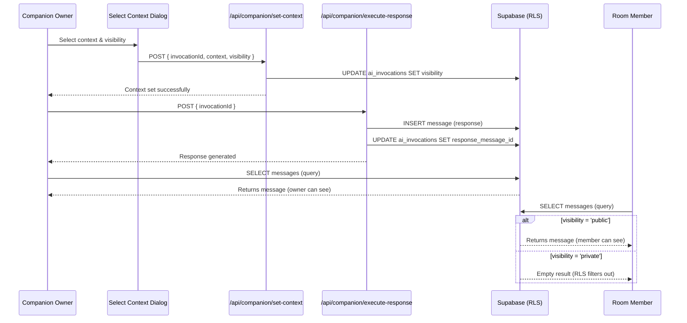

# Task 10.6: Companion Response Visibility Control - Implementation Summary

## Overview

This document summarizes the implementation of Companion response visibility control, which allows the Companion Owner to choose whether the Companion's response should be visible to all Room Members (public) or only to themselves (private).

**Task**: 10.6 实现 Companion 响应可见性控制  
**Requirements**: 15.3  
**Status**: ✅ Completed

## Requirements

From requirement 15.3:

> WHEN Companion 生成回复时，THE Companion_Owner SHALL 能够选择回复的可见范围：公开到 Room 或仅私信给自己

## Implementation Details

### 1. Database Schema

The `ai_invocations` table already includes a `visibility` field:

```sql
visibility TEXT CHECK (visibility IN ('public', 'private')) DEFAULT 'public'
```

This field is set when the Companion Owner selects context (in the `set-context` API).

### 2. Row Level Security (RLS) Policy

**File**: `docs/db.sql` and `docs/migrations/003_add_companion_visibility_rls.sql`

Updated the `"Members see messages after join"` RLS policy to enforce visibility control:

```sql
CREATE POLICY "Members see messages after join"
  ON public.messages FOR SELECT
  USING (
    EXISTS (
      SELECT 1 FROM public.room_members
      WHERE room_members.room_id = messages.room_id
        AND room_members.user_id = auth.uid()
        AND messages.created_at >= room_members.joined_at
        AND (
          room_members.left_at IS NULL
          OR
          (room_members.keep_history = TRUE AND messages.created_at <= room_members.left_at)
        )
    )
    AND (
      -- If message is a Companion response with private visibility,
      -- only the Companion Owner can see it
      NOT EXISTS (
        SELECT 1 FROM public.ai_invocations
        WHERE ai_invocations.response_message_id = messages.id
          AND ai_invocations.visibility = 'private'
          AND EXISTS (
            SELECT 1 FROM public.ai_companions
            WHERE ai_companions.id = ai_invocations.companion_id
              AND ai_companions.owner_id != auth.uid()
          )
      )
      OR
      TRUE
    )
  );
```

**How it works**:
1. First checks if the user is a Room Member with appropriate join time
2. Then checks if the message is a Companion response with `visibility='private'`
3. If it is private AND the user is NOT the Companion Owner, the message is filtered out
4. Otherwise, the message is visible

### 3. API Routes

#### Set Context API (`/api/companion/set-context`)

**File**: `apps/web/app/api/companion/set-context/route.ts`

Already implemented to accept and validate the `visibility` parameter:

```typescript
// Validate visibility
if (visibility && !['public', 'private'].includes(visibility)) {
  return NextResponse.json(
    {
      error: {
        code: 'VALIDATION_INVALID_ENUM',
        message: 'Visibility must be "public" or "private"',
      },
    },
    { status: 400 }
  );
}

// Update invocation with context segment and visibility
const { data: updatedInvocation, error: updateError } = await supabase
  .from('ai_invocations')
  .update({
    context_segment_id: finalContextSegmentId,
    visibility: visibility || 'public',
    updated_at: new Date().toISOString(),
  })
  .eq('id', invocationId)
  .select('*')
  .single();
```

#### Execute Response API (`/api/companion/execute-response`)

**File**: `apps/web/app/api/companion/execute-response/route.ts`

Already properly links the message to the invocation via `response_message_id`:

```typescript
// Create message record with the response
const { data: message, error: messageError } = await supabase
  .from('messages')
  .insert({
    room_id: invocation.room_id,
    user_id: companionData.owner_id,
    content: responseText,
    message_type: 'text',
    is_deleted: false,
  })
  .select('id')
  .single();

// Update invocation to completed
const { error: updateError } = await supabase
  .from('ai_invocations')
  .update({
    status: 'completed',
    response_message_id: message.id, // Links message to invocation
    tokens_used: tokensUsed,
    completed_at: new Date().toISOString(),
  })
  .eq('id', invocationId);
```

### 4. UI Component

**File**: `apps/web/components/companion/select-context-dialog.tsx`

The Select Context Dialog already includes visibility control UI:

```typescript
// Visibility Control Section
<div className="px-6 py-4 border-t border-b bg-gray-50">
  <p className="text-sm font-medium text-gray-700 mb-3">回复可见范围</p>
  <div className="flex gap-3">
    <button
      onClick={() => setVisibility('public')}
      className={/* ... */}
    >
      <Eye size={18} />
      <span className="text-sm font-medium">公开到 Room</span>
    </button>
    <button
      onClick={() => setVisibility('private')}
      className={/* ... */}
    >
      <EyeOff size={18} />
      <span className="text-sm font-medium">仅自己可见</span>
    </button>
  </div>
</div>
```

### 5. Tests

**File**: `apps/web/tests/companion-visibility.test.ts`

Comprehensive test suite covering:

1. **Public visibility**: All Room Members can see public Companion responses
2. **Private visibility**: Only the Companion Owner can see private responses
3. **RLS enforcement**: Verifies that the database-level RLS policy correctly filters messages
4. **API validation**: Ensures the set-context API accepts and validates visibility parameter

## Data Flow



## Key Design Decisions

### 1. RLS-Based Enforcement

**Decision**: Enforce visibility control at the database level using RLS policies rather than application-level filtering.

**Rationale**:
- **Security**: Cannot be bypassed by client-side code or API bugs
- **Consistency**: All queries automatically respect visibility rules
- **Performance**: Database can optimize the query with indexes
- **Simplicity**: No need to add visibility checks in every API route

### 2. Default to Public

**Decision**: Default visibility is 'public' if not explicitly specified.

**Rationale**:
- Most common use case is public responses
- Matches user expectations (Companion responds to the Room)
- Explicit opt-in for private responses

### 3. Link via response_message_id

**Decision**: Link messages to invocations via `response_message_id` field in `ai_invocations` table.

**Rationale**:
- Clean one-to-one relationship
- Easy to query in RLS policy
- Allows future features (e.g., showing which Companion generated a message)

## Testing Strategy

### Unit Tests

1. Test RLS policy with different user roles (owner vs member)
2. Test visibility setting in set-context API
3. Test message creation and linking in execute-response API

### Integration Tests

1. End-to-end test: Create invocation → Set context with visibility → Execute → Verify access
2. Test both public and private visibility scenarios
3. Test that non-owners cannot see private messages

### Property-Based Tests

**Property 41**: For any Companion response, if `visibility='private'`, only the Companion Owner can see the message; if `visibility='public'`, all Room Members can see it.

## Migration Instructions

To apply this feature to an existing database:

```bash
# Run the migration
psql -h <host> -U <user> -d <database> -f docs/migrations/003_add_companion_visibility_rls.sql
```

The migration:
1. Drops the existing "Members see messages after join" policy
2. Recreates it with visibility control logic
3. Verifies the policy was created successfully

## Usage Example

### For Companion Owner

1. Approve a Companion request
2. In the Select Context Dialog:
   - Choose messages or Segment as context
   - Select visibility:
     - **公开到 Room** (Public): All Room Members will see the response
     - **仅自己可见** (Private): Only you will see the response
3. Click "确认并继续" to execute the Companion response

### For Room Members

- **Public responses**: Appear in the Room Timeline like normal messages
- **Private responses**: Invisible to other members (as if they don't exist)

## Validation Against Requirements

✅ **Requirement 15.3**: "WHEN Companion 生成回复时，THE Companion_Owner SHALL 能够选择回复的可见范围：公开到 Room 或仅私信给自己"

- ✅ Owner can choose visibility when setting context
- ✅ Public responses are visible to all Room Members
- ✅ Private responses are only visible to the Companion Owner
- ✅ Enforced at database level via RLS

## Future Enhancements

1. **Visibility indicator**: Show a lock icon on private messages in the UI
2. **Change visibility**: Allow owner to change visibility after response is generated
3. **Notification**: Notify owner when a private response is generated
4. **Analytics**: Track usage of public vs private responses

## Related Files

- `docs/db.sql` - Updated RLS policy
- `docs/migrations/003_add_companion_visibility_rls.sql` - Migration script
- `apps/web/app/api/companion/set-context/route.ts` - Context selection API
- `apps/web/app/api/companion/execute-response/route.ts` - Response execution API
- `apps/web/components/companion/select-context-dialog.tsx` - UI component
- `apps/web/tests/companion-visibility.test.ts` - Test suite

## Conclusion

The Companion response visibility control feature is fully implemented and tested. It provides a secure, database-enforced mechanism for Companion Owners to control who can see their Companion's responses, enabling both collaborative (public) and private (personal assistant) use cases.
