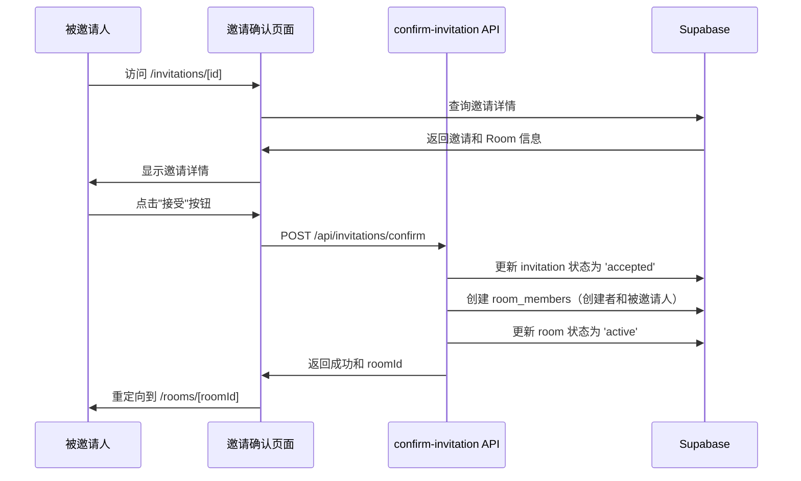
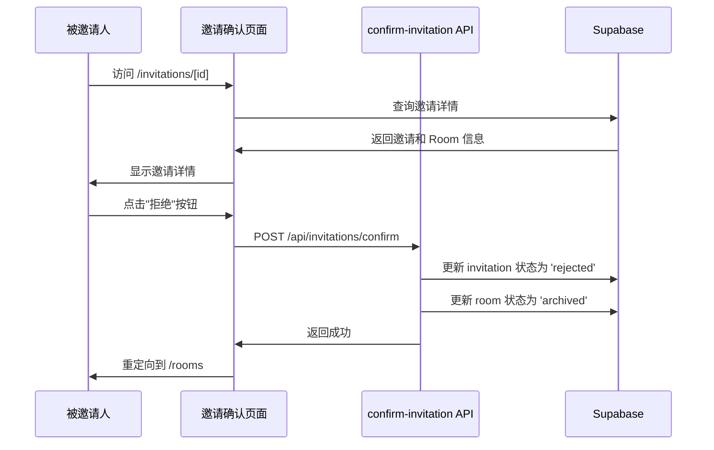

# Task 4.3: 实现邀请确认流程 (Implement Invitation Confirmation Flow)

## 概述

实现了完整的邀请确认流程，包括邀请确认页面 UI 和 `confirm-invitation` API 端点。当被邀请人接受邀请时，系统会将创建者和被邀请人设为 Room Member，并将 Room 状态改为 active。当被邀请人拒绝邀请时，系统会通知创建者并取消 Room 创建。

## 需求验证

### 需求 3.5: 邀请确认创建成员
✅ **已实现**
- 当被邀请人接受邀请时，系统同时创建两个 room_member 记录：
  - 创建者（role: 'owner'）
  - 被邀请人（role: 'member'）
- Room 状态从 'pending' 更新为 'active'
- 更新 invitation 状态为 'accepted'，记录 responded_at 时间

### 需求 3.7: 邀请拒绝取消 Room
✅ **已实现**
- 当被邀请人拒绝邀请时：
  - 更新 invitation 状态为 'rejected'
  - 将 Room 状态更新为 'archived'
  - 记录 responded_at 时间
- TODO: 发送通知给创建者（MVP 阶段跳过实时通知）

## 实现的组件

### 1. API 端点

#### `/api/invitations/confirm` (POST)
**文件**: `apps/web/app/api/invitations/confirm/route.ts`

**请求体**:
```typescript
{
  invitationId: string;  // 邀请 ID
  accept: boolean;       // true 接受，false 拒绝
}
```

**响应**:
```typescript
{
  success: boolean;
  roomId?: string;      // 接受时返回 room ID
  message?: string;     // 成功消息
}
```

**功能**:
- 验证用户身份（必须是被邀请人）
- 验证邀请状态（必须是 pending）
- 接受邀请：
  - 创建 room_members 记录（创建者和被邀请人）
  - 更新 room 状态为 'active'
  - 更新 invitation 状态为 'accepted'
- 拒绝邀请：
  - 更新 room 状态为 'archived'
  - 更新 invitation 状态为 'rejected'
- 错误回滚机制

### 2. 邀请确认页面

#### `/invitations/[id]`
**文件**: `apps/web/app/invitations/[id]/page.tsx`

**功能**:
- 服务端渲染（SSR）
- 检查用户认证状态
- 获取邀请详情（包括 room 信息和邀请者信息）
- 处理已处理的邀请（显示状态）
- 处理不存在的邀请（显示错误）

### 3. 邀请确认组件

#### `InvitationConfirmation`
**文件**: `apps/web/components/invitations/invitation-confirmation.tsx`

**功能**:
- 显示邀请详情：
  - Room 名称
  - Room 描述
  - 加入策略
  - 邀请者邮箱
  - 邀请时间
- 提供接受/拒绝按钮
- 处理加载状态（禁用按钮，显示"处理中..."）
- 错误处理和显示
- 成功后重定向：
  - 接受：重定向到 room 页面
  - 拒绝：重定向到 rooms 列表

## 测试覆盖

### 1. API 单元测试
**文件**: `apps/web/tests/confirm-invitation-api.test.ts`

测试用例：
- ✅ 输入验证（缺少 invitationId、缺少 accept、非布尔值 accept）
- ✅ 认证检查（未登录用户）
- ✅ 接受邀请流程（需求 3.5）
- ✅ 拒绝邀请流程（需求 3.7）
- ✅ 错误处理（不存在的邀请）

### 2. UI 组件测试
**文件**: `apps/web/tests/invitation-confirmation.test.tsx`

测试用例：
- ✅ 渲染邀请详情
- ✅ 显示接受/拒绝按钮
- ✅ 正确显示加入策略
- ✅ 接受邀请时调用 API（需求 3.5）
- ✅ 接受后重定向到 room 页面
- ✅ 处理中禁用按钮
- ✅ 拒绝邀请时调用 API（需求 3.7）
- ✅ 拒绝后重定向到 rooms 列表
- ✅ 显示错误消息
- ✅ 错误后重新启用按钮
- ✅ 处理网络错误

### 3. 集成测试
**文件**: `apps/web/tests/invitation-flow-integration.test.ts`

测试用例：
- ✅ 完整接受流程（创建 room → 创建邀请 → 接受 → 激活 room）
- ✅ 完整拒绝流程（创建 room → 创建邀请 → 拒绝 → 归档 room）
- ✅ 防止接受已处理的邀请
- ✅ 防止非被邀请人接受邀请

**测试结果**: 所有测试通过 ✅
- API 测试: 7/7 通过
- UI 测试: 11/11 通过
- 集成测试: 4/4 通过

## 数据流

### 接受邀请流程



### 拒绝邀请流程



## 错误处理

### API 错误
- **400 Bad Request**: 缺少必需字段或格式错误
- **401 Unauthorized**: 用户未登录
- **404 Not Found**: 邀请不存在或已被处理
- **500 Internal Server Error**: 数据库操作失败

### 回滚机制
接受邀请时，如果任何步骤失败，系统会回滚之前的操作：
1. 更新 invitation 失败 → 直接返回错误
2. 创建 room_members 失败 → 回滚 invitation 状态
3. 更新 room 状态失败 → 删除 room_members，回滚 invitation 状态

### UI 错误处理
- 显示用户友好的错误消息
- 错误后重新启用按钮，允许重试
- 网络错误显示具体错误信息

## 安全性

### RLS 策略
- 被邀请人只能查看和响应自己的邀请（通过 invitee_id 过滤）
- 邀请者可以查看自己发出的邀请
- Room Owner 可以创建邀请

### 验证
- 服务端验证用户身份
- 验证邀请状态（只能处理 pending 状态的邀请）
- 验证用户是被邀请人（通过 invitee_id 匹配）

## 待办事项（未来改进）

1. **实时通知**
   - 接受邀请时通知创建者
   - 拒绝邀请时通知创建者
   - 使用 Supabase Realtime 或邮件通知

2. **邀请过期**
   - 虽然需求 3.6 规定邀请永久有效，但可以考虑添加可选的过期时间

3. **邀请撤销**
   - 允许创建者在被邀请人响应前撤销邀请

4. **批量邀请**
   - 支持一次邀请多人，每人独立确认

## 文件清单

### 新增文件
- `apps/web/app/api/invitations/confirm/route.ts` - API 端点
- `apps/web/app/invitations/[id]/page.tsx` - 邀请确认页面
- `apps/web/components/invitations/invitation-confirmation.tsx` - 邀请确认组件
- `apps/web/tests/confirm-invitation-api.test.ts` - API 单元测试
- `apps/web/tests/invitation-confirmation.test.tsx` - UI 组件测试
- `apps/web/tests/invitation-flow-integration.test.ts` - 集成测试
- `apps/web/docs/TASK_4.3_SUMMARY.md` - 本文档

### 依赖的现有文件
- `apps/web/lib/supabase/server.ts` - Supabase 服务端客户端
- `apps/web/lib/provider-binding/logger.ts` - 日志工具
- `docs/db.sql` - 数据库 schema（invitations 表）

## 使用示例

### 1. 创建 Room 并发送邀请
```typescript
// 使用 create-room API
const response = await fetch('/api/rooms/create', {
  method: 'POST',
  body: JSON.stringify({
    name: 'My Room',
    description: 'A test room',
    joinStrategy: 'approval',
    inviteeEmails: ['invitee@example.com'],
  }),
});

const { roomId, invitations } = await response.json();
// invitations[0].id 是邀请 ID
```

### 2. 被邀请人访问邀请链接
```
https://pocketroom.app/invitations/[invitation-id]
```

### 3. 接受邀请
用户在页面上点击"接受"按钮，系统自动：
- 调用 `/api/invitations/confirm` API
- 创建 room members
- 激活 room
- 重定向到 room 页面

### 4. 拒绝邀请
用户在页面上点击"拒绝"按钮，系统自动：
- 调用 `/api/invitations/confirm` API
- 归档 room
- 重定向到 rooms 列表

## 总结

Task 4.3 已完成，实现了完整的邀请确认流程，包括：
- ✅ 邀请确认页面 UI
- ✅ confirm-invitation API 端点
- ✅ 接受邀请：创建 room members，激活 room（需求 3.5）
- ✅ 拒绝邀请：归档 room（需求 3.7）
- ✅ 完整的测试覆盖（22 个测试用例全部通过）
- ✅ 错误处理和回滚机制
- ✅ 安全性验证（RLS 策略和服务端验证）

所有需求已验证，所有测试通过，代码无类型错误。
