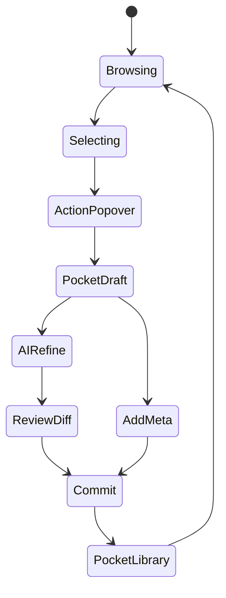

# Sprint1b · 浏览器插件 EB 交互设计文档

> Date: 2026-01-26

本文档描述 Sprint1b（Pocket / EB）的**浏览器插件交互设计**，重点解决：
- 零散摘取（第15/20/30段）
- 可选整理 / 压缩
- 低风险、用户主动触发的数据采集

---

## 1. 三种采集动作

### A. 选中 + 悬浮按钮（v0 必做）
- 用户框选文本
- 弹出“放入口袋”按钮
- 心智成本最低、法律风险最小

### B. 双击消息块（v0.5）
- 双击 AI 或人类的一条发言
- 自动选中该段
- 需防误触

### C. 拖拽到 Pocket 侧栏（v1）
- 右侧 Pocket 抽屉
- 支持多次拖拽 → 统一整理

---

## 2. 总体状态机（用户视角）

---

## 3. 零散摘取与 Basket（临时篮子）

- 支持多段摘取
- Basket 作为临时收集区
- 允许“稍后整理”

---

## 4. 整理/压缩颗粒度

- 轻整理：去口水
- 中整理：补桥接句
- 强整理：结构化要点

---

## 5. 风险边界声明

- 仅处理用户**主动选择**内容
- 不抓取系统 prompt / 平台 metadata
- 不后台扫描、不自动采集
