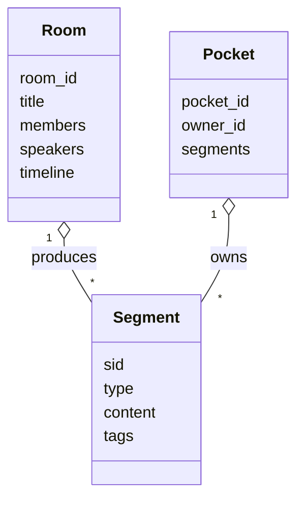
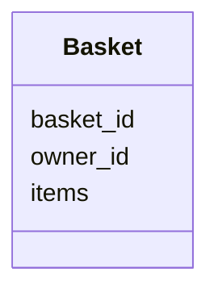

# Sprint1 · 对象模型与 UML

> Date: 2026-01-26

本文档定义 Sprint1（EA + EB）的**核心对象模型**，用于支撑多人 + 多 AI 的讨论与上下文资产化。

---

## 1. 核心对象关系

---

## 2. Basket（临时篮子）

---

## 3. 设计原则

- Room = 现场（不追求结构）
- Pocket = 私有资产库
- Segment = 跨场景最小单元
